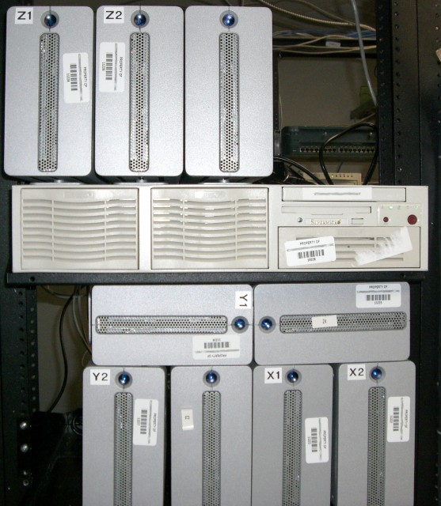

:octicons-calendar-24: April 9, 2009

Sometimes I like to stay late at work, I've got a nice desk, a decent computer, and a mini-fridge full of drinks right behind me. So even after I'm off work, I sometimes stay up here and work on side projects or just browse the web. Yesterday, I decided to do something a bit more creative, I decided to build a monster.

We recently came into the possession of several LaCie external hard drives. Most of these are 1.6TB and can use firewire or USB to connect to a computer. The downside to these drives, is that they aren't actually one single drive, each one is an enclosure with 4 IDE drives inside it setup to use JBOD or something similar to RAID 0. If even one of those drives dies, the entire LaCie is lost. Needless to say, we don't have a lot of use for what amounts to a giant hard drive with a death wish.

So I figured, lets see how many I can hook up to one system, then software raid them and see how fast they are. I had a dual 2.4Ghz XEON box laying around, so I threw in a bunch of firewire cards. I had to remove the entire back of the case just to fit the cards, otherwise we wouldn't be able to use the card on the far left or the far right.

As you can see, I also had to remove the back panel of the firewire cards, since I didn't have any half height ones to use. All in all, it makes for quite an ugly setup. Here's the front and back of the entire thing:

As of right now I've got mdadm (the Linux software raid utility) building a RAID 6 out of the 1.6TB drives. When I first started building the array I was given an ETA of 1,500 minutes. For those of you that can't do the math in your head (I can't), that's 25 hours! Right now it's at about 80% complete. I'll update this article sometime tomorrow, after I've got the array formatted for ext3,  which will probably take quite awhile.

#### UPDATE

The raid finally finished building, in total it took just under 24 hours, it took another 45 minutes to format the partition to ext3. I ran a quick test with hdparm to see how fast the array was, the individual drives are capable of about 70MBps and the array as a whole clocks in at around 150MBps. Not great, but not too bad either, the real test will be seeing how long the array stays online, since the LaCie drives aren't exactly the most robust storage devices.
