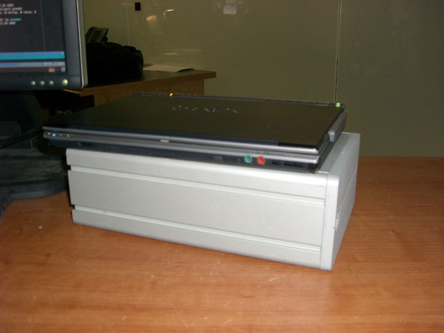
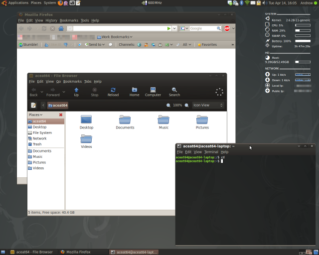

# Cooling Off

I've been running Ubuntu 9.04 beta on my desktop at home for a few weeks now, so I decided it was time to upgrade my laptop. I hoped that by upgrading, I'd be able to signifigantly reduce the time it took for my laptop to boot up. Unfortunetly, disaster stuck halfway through. My laptop overheated and locked up, leaving me with half new and half old packages. Needless to say, it did not come back online very easily. I managed to get it to a point where I could copy my data off to another computer, then I did a fresh install of Ubuntu.

<!-- more -->

I was prepared this time though, I decided I needed a way to insure my laptop will stay cool. I grabbed a dead LaCie external hard drive (one of the spares from [The Monster](http://wedontsupportyou.com/2009/04/08/birth-of-a-monster)) and set my laptop on it. These things are HEAVY, the outer case of the drive is made of a pretty solid metal (possibly steel, it feels too heavy to be aluminum) and it works great as a makeshift heatsink.

As you can see, it's not the nicest looking heatsink, but it'll have to do until I can fix the overheating problem. On the plus side, Ubuntu 9.04 is running great. The laptop boots up much faster then before and I love the new "Dust" theme. It's the first dark colored theme for Gnome that I've found to actually work well, it's also fairly compact which is great since the laptop has a small screen.

Tomorrow I plan on posting a tutorial on how to I tweaked my Nagios setup at work to monitor 3000 servers every 3 minutes.
