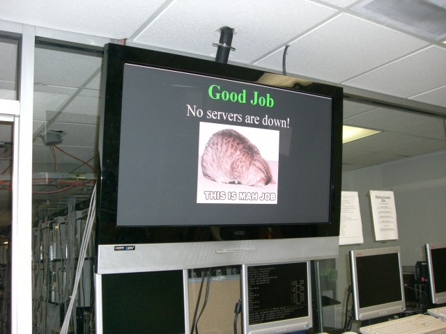

# Tweaking Nagios For Performance

The company I work for has about 3,000 servers that need to be monitored in our Dallas datacenter. For the past few years we've been using a fairly standard Nagios setup. If you don't take the time to really learn Nagios and tweak the config files it'll run fairly well, until you are monitoring more then a few hundred servers. The reason that Nagios slows down when checking 300+ servers is that it stores all state/check information in a flat text file on the system's hard drive. When you have only a few servers and services to check it's not so bad, but when you the more you add, the more IOPS you'll see. At 3,000 servers disk IO is a **huge** bottleneck.

<!-- more -->

A lot of systems will be fairly responsive but show a really high load average, this is because of IO wait. Fortunately, the guy who setup Nagios at our DC was smart enough to realize we had a massive issue with disk IO and so he had everything running off 4x 15k RPM SCSI drives with a hardware RAID 10. Unfortunately, even with the fairly substantial hardware Nagios still took nearly 20 minutes to check every system in the datacenter. For a while, this was considered acceptable, because we didn't want to pay thousands of dollars for a commercial system and this particular admin was convinced that Nagios was running as fast as possible for now and that maybe the Nagios developers would speed things up in a later version.

The old Nagios system grabbed it's information about what to monitor from a program we had called "Server Locator", which would soon be replaced with a database in Microsoft's SharePoint. So it fell to me to modify our existing Nagios system to grab it's configuration information from SharePoint instead of Server Locator. I had just recently been promoted to Jr. Admin, so I hadn't had a chance to look at Nagios and see how things were setup. I took one look at the system and decided it would be easier to setup a new one, on my terms. This meant that I could do things my way (hopefully that means the right way), and the old system could be kept ready in case the swichover didn't go smoothly.

The first thing I looked into using was a distributed Nagios setup, but after only a day of playing with it I ran into a huge problem. It was **slow, really slow**, and I had no idea why. I had 3 boxes setup, the main system was called _mother.nag_, the others were named after the phases (sections of the datacenter) that they would be monitoring. Eventually I discovered that the problem was due to how Nagios communicated back to the main server. A daughter server (mother/dauther, get it? I know I'm clever) would perform a service check, and then report the result back to the mother server. Even if the check itself took only a fraction of a second, the entire exchange would always take at least 1 second. While this alone wasn't a huge issue, it was some fairly signifigant overhead. The real problem was that during the time that Nagios on the daughter server was communicating with the mother server it was doing **nothing else**. For some reason, during the communication it wouldn't do anything else, such as performing other service checks. This meant that if there were 300 servers in a phase (about average) it would take 5 minutes to scan the entire phase and report back.

Maybe I'm just weird, but to me this was unacceptable, I knew Nagios could do things faster. The servers showed almost no load, or network traffic during normal operation, there was no reason why one system shouldn't be able to monitor everything in the datacenter. So I went back to the drawing board. Then it hit me, the system we had before only really had issues with disk IO, so what if I could just cut out that bottleneck, how fast would things go? So I moved the all the files nagios uses to a ramdisk, and then setup a quick cron-job to save them to disk once a minute.

``` cron
# m h  dom mon dow   command
*/5 *   *   *   *    /usr/bin/rsync -a /dev/shm/ /var/nagios3/; rm /var/nagios3/lib/spool/checkresults/*; rm /var/nagios3/cache/nagios.tmp*; rm -rf /var/nagios3/nagios-config-*; chgrp www-data /dev/shm/lib/rw/nagios.cmd;
```

The server I had setup was using Ubuntu, which means it has a ramdisk mounted at /dev/shm. The ramdisk is allowed to use up to half of the memory in the system, which was fine with me since I had 2GB of ram and in total all the configuration files and cache files for Nagios came out to a whopping 16MB.

With Nagios now using the ramdisk I decided to test it out by monitoring the everything in the datacenter. Why start small, if I was right this would be _really fast_, and sometimes I just love being recklessly over-confident in my ideas. So I started up Nagios and watched it make a scan of the datacenter. Once it was done I was disappointed, it was still taking too long, it took nearly 5 minutes to complete the scan of the datacenter. I was disappointed because even though I was now showing a 300% increase in speed over the original Nagios setup I noticed that my test box still have virtually no load while running the service checks. I knew I could make it go faster, but how would I do it?

So I decided to throughly read the parts of the Nagios manual that I had glossed over, namely the section that deals with scheduling of host/service checks. I figured the issue was that the system just wasn't scheduling enough checks to happen in parrallel. This was backed up by the performance data, which showed that while my _Check Execution Time_ was low (around 0.105 seconds on average) my _Check Latency_ was much higher (I believe around 10 seconds or so on average). After much testing and tweaking I finally found the perfect settings. Please note, that the system I am running Nagios on has two dual-core Xeon processors. This is important to keep in mind, because the settings below will cause Nagios to spawn **hundreds** of processes at the same time. I strongly recommend you get as many cores (real cores, not hyper-threading) in your monitoring system so that you can make the most out of this setup.

``` toml
service_inter_check_delay_method=0.01
service_interleave_factor=s
host_inter_check_delay_method=0.02
max_concurrent_checks=0
use_large_installation_tweaks=1
```

I set the _Service Inter-Check Delay_ to a static 0.01 seconds, so that checks would happen as fast as possible. Combined with the _Max Concurrent Checks_ set unlimited, this means that Nagios spawns processes for service checks like it's Zerg rushing. Luckily, the system's 4 cores handle everything pretty well. We only monitor one or two services (by default) for each server, so I didn't care too much about service interleaving, I left it up to Nagios to determine how to interleave service checks. Using _Large Installation Tweaks_ is pretty standard for large Nagios installs, so you should already have that set. With these settings, and everything in the /dev/shm ramdisk, Nagios can now monitor every system in our datacenter in about **50 seconds**. Yes, that's right, we can monitor the entire datacenter **once a minute**.

<figure markdown>
  
  <figcaption>This screen lists out servers that are down (white means it's down but acknowledged)</figcaption>
</figure>

I decided that in order to not overload customer's servers with traffic, that by default we'll run a service check every 3 minutes. If the a problem is detected, the interval for that service/host drops down to 1 minute until the service/host is determined to be in a "hard down" state. The best part is that because the old Nagios was so slow, we purchased a commercial system (Site Scope) to monitor the core infrastructure. About a week after my Nagios seutp went live it detected that the webserver that ran our main website went down, and so it sent out alerts to our blackberries. The commercial solution alerted us **4 minutes later**. I was told that our CEO was extremely impressed with how quickly Nagios was able to detect and report the issue.

<figure markdown>
  
  <figcaption>Good job, here is a lolcat</figcaption>
</figure>

If you have any questions, feel free to use the comments section.


