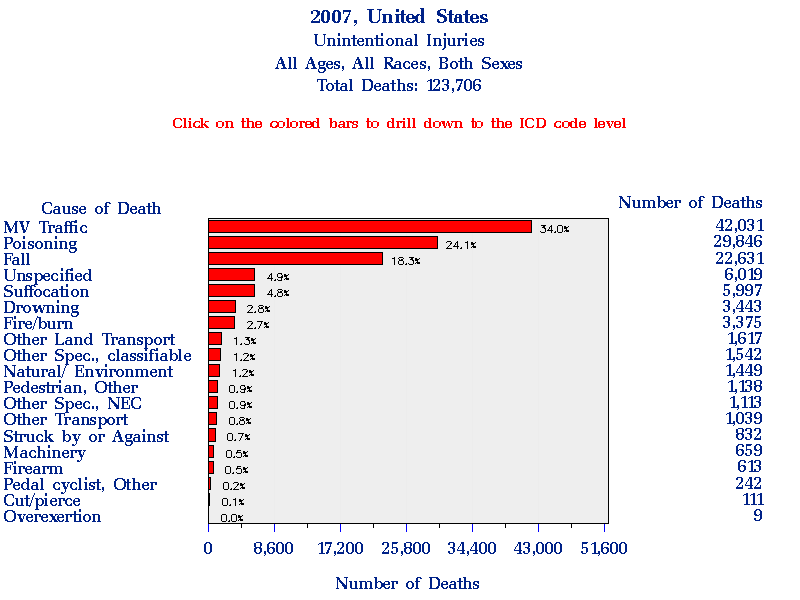

# "Smart" Guns - Dangerously Dumb

Recently on [NerdAbsurd](http://nerdabsurd.com/) we discussed "Smart" guns, in which I took up the task of refute an article on [Slate.com](http://www.slate.com/articles/technology/technology/2012/12/smart_guns_we_have_the_technology_to_make_safer_guns_too_bad_gunmakers_don.html) written by Farhad Manjoo. When Virginia first sent me a link to the article asking my opinion, I knew I would have more than a few things to say after reading just the title: "We Have the Technology To Make Safer Guns: Too bad gunmakers don’t care." For now, I'm going to overlook the idea that there is some grand conspiracy of firearms manufacturers and tackle the idea of "smart" guns themselves.

<!-- more -->

## Technology is not a fix for poor safety practices

I do not believe in the idea of "Accidental" Discharges (AD's in gun-lingo), and instead subscribe to the idea of Negligent Discharges (ND's). To me, anytime a firearm is fired unintentionally it is not an accident, it is negligence on the part of the operator. A modern firearm does't just "go off", they have various safeties to ensure that a round is only fired when someone pulls the trigger. For example, I own a Springfield Armory XD-9, it has the following safety features:

- Grip safety - Unless the grip safety is depressed, the trigger can not be pulled and the slide can not be actuated.
- Trigger safety - The trigger is made of two pieces, requiring the user to press in on the center of the trigger, and limiting the ability for foreign objects to "grab" on to the trigger and actuate it.
- Drop safety - This part is a small block that prevents the striker from hitting the firing pin. It is pushed out of the way only when the grip safety is depressed and the trigger is pulled. In it's default state, the drop safety prevents a round from being fired if the firearm is dropped or hit.

Some of these are not new features, the extremely popular 1911, which as been around since, well 1911, has a grip safety.

So if we've ruled out the possibility that guns just "go off", what is the root cause of these accidents? Negligence and poor safety practices. As with any dangerous piece of equipment (cars, table saws, fire, etc) there are safety rules that should be followed. For firearms, some of the most basic rules are:

[{ width="300" align=right loading=lazy }](images/1357160507202.jpg)

1. Treat every gun as if it is loaded.
2. Don't point a gun at something unless you intend to shoot it.
3. Don't put your finger on the trigger unless you intend to fire.

Virtually all Negligent Discharges are caused by the operator failing to follow one of those rules. A fairly common one is pulling the trigger without thinking, when grasping a firearm while not paying attention, it is easy for your finger to slide into the trigger guard and pull the trigger when you tighten your group.

As this image demonstrates  you should get in the habit of resting your index finger alongside the gun, NOT on the trigger.

Mainly, this is an issue of training. We teach (or should) safe sex in schools, it shouldn't be controversial to also teach people how to safely handle firearms. In my opinion, you put your child at risk if you don't teach them firearm safety, because their only knowledge would be from movies, TV shows and video games, which more often than not, portray poor safety practices or outright nonsense with regards to firearms.

## 1 in 100 is a terrible failure rate for a modern firearm

Many people own firearms so that they can protect themselves or their loved ones. Part of what makes a modern firearm a great defensive weapon is reliability. Here is what Farhad wrote in the article on the system's reliability, or rate of successful identification:

> “We’re better than a 99 percent false negative rate,” Sebastian says. “An authorized user will be recognized 99 times out of a 100.” (This does mean that one time out of 100, you’ll go to fire your gun and it won’t shoot—though as Sebastian points out, guns often fail for mechanical reasons, so a 1 percent chance of failure wasn’t considered a fatal flaw.)

I have fired around 5,000 rounds through my XD-9, with only 1 failure (ammo related). This is not a statistical anomaly, modern firearms, using good ammo, are incredibly reliable. I wouldn't trust the defense of my family to a firearm that had a 1 in 100 chance of failing on each trigger pull. Even if the technology for these "smart" guns had a failure rate of 1 in 1000, the technology is still more unreliable then your average pistol.

Here's the real kicker, according to the paper "[Handgrip Recognition](http://www.scientificjournals.org/journals2007/articles/1226.pdf)" that Farhad linked to in his article, the **actual** rate of successful identification was only 89.44%, roughly a 1 in 10 chance that the system will fail to properly recognize the user. Many pistols have 10, 13 or 16 round magazines. If I owned a firearm that failed roughly once per magazine, I would send it in for repair.

## Smart guns allow people to (wrongly) feel complacent with safety

We have already identified that accidents happen because people neglect safety, what happens if we throw a "smart" gun into the mix? It is easy for people to get complacent, but to do so with safety (for any tool) is a recipe for disaster. "Smart" guns allow people to wrongly feel that they are safe handling someone else's weapon, because it "can't" be fired by unauthorized users. If this technology is ever mandated, I imagine that it would not be too long before we see accidents where people shoot themselves or their friends because "it **shouldn't** have fired".

One thing I found odd was that the paper made no mention of the false positive rate, which is how often the system would incorrectly identify an unauthorized user as authorized, allowing them to fire the weapon. Let's be generous and pretend the rate is 1 in 100. People are curious, they'll want to see if the biometrics really work, so obviously they'll try it out, likely with an unloaded gun. Most of the time, it will probably work just fine, but now the person has a false belief that the system works, it's "safe", they easily grow complacent. What happens later on, when they're showing off the system to friends, and that 1 in 100 false positive strikes? Potentially, someone gets shot by a gun that "**shouldn't** have fired, it had a safety!"

You can't fix poor safety practices with technology, you can only fix them with education and vigilance.

## Smart guns are a solution in search of a problem

[{ width="300" align=right loading=lazy }](images/2007_CDC_unintentional_deaths.gif)

After hearing about some of the heartbreaking incidents such as Joseph Loughrey shooting his 7 year old son, you might be wondering, how common are these tragedies? Fortunately, [according to the CDC](http://webappa.cdc.gov/sasweb/ncipc/leadcaus10.html) they are exceedingly rare, roughly 600/year. While each life lost is tragic, when making policy decisions we have to look at real world risks. Firearm accidents comprise only 0.5% of all fatal accidents, they are far outweighed by deaths from motor vehicle traffic (34%), poisoning(24.1%), falls(18.3%), suffocation(4.8%), drowning(2.8%), and fire/burns(2.7%).

We don't have to look to the latest James Bond style gadget to make our lives safer, plenty of guns already come with good, solid safety features. The missing component for many people, is knowledge. If you own firearms, not only do you need to be aware of how to safely handle firearms, it is up to you to teach those around you how to properly handle these tools. Everyone should be taught the basics of firearm safety, you should teach your children, family and friends, even if they don't own guns.

For more information on firearm safety, please check out these links:

- [http://darkwing.uoregon.edu/~joe/firearms-safety.html](http://darkwing.uoregon.edu/~joe/firearms-safety.html)
- [http://nssf.org/safety/basics/](http://nssf.org/safety/basics/)
- [http://eddieeagle.nra.org/](http://eddieeagle.nra.org/)
